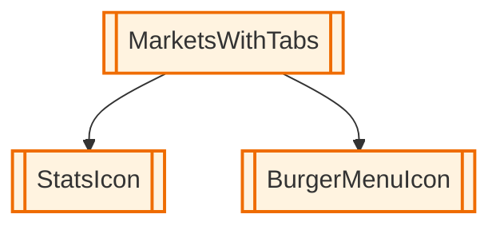

# React Component Analyzer

A tool that analyzes React components and builds a dependency graph by parsing TSX files and finding component relationships.

## Features

- Parses TSX files and builds AST (Abstract Syntax Tree)
- Finds React component declarations (function, class, arrow functions)
- Identifies locally imported components (not from packages)
- Recursively traverses imported files to build complete dependency graph
- Outputs JSON format with component declarations and relationships

## Usage

```bash
# Install dependencies
yarn install

# Run the analyzer
tsx src/index.ts <file.tsx> <component-name>
```

## Example

```bash
tsx src/index.ts test-example.tsx App
```

This will analyze the `App` component in `test-example.tsx` and:
- Output a JSON graph to the console showing:
  - All component declarations found in the file and imported files
  - Relationships between components (which components use which other components)
- Save the same JSON result to a file named `test-example-App-analysis.json` in the `output/` directory

## Output

The tool provides output in two ways:

### Console Output
The analysis result is displayed in the console with a formatted header.

### File Output
The same JSON result is automatically saved to a file in the `output/` directory with the naming pattern:
`output/{input-file-name}-{component-name}-analysis.json`

For example, analyzing `App` component in `test-example.tsx` creates:
`output/test-example-App-analysis.json`

The `output/` directory is automatically created if it doesn't exist and is ignored by git.

## Output Format

The tool outputs JSON with the following structure:

```json
{
  "declarations": [
    {
      "name": "ComponentName",
      "file": "/path/to/file.tsx",
      "line": 10,
      "column": 5,
      "type": "function"
    }
  ],
  "relations": [
    {
      "from": "ParentComponent",
      "to": "ChildComponent",
      "line": 15,
      "column": 10
    }
  ]
}
```

## Component Types Supported

- Function declarations: `function MyComponent() {}`
- Function expressions: `const MyComponent = function() {}`
- Arrow functions: `const MyComponent = () => {}`
- Class components: `class MyComponent extends React.Component {}`

## Requirements

- TypeScript/TSX files
- React components that start with uppercase letters
- Local imports (relative paths starting with `./` or `/`)

## Mermaid Diagram Generator

After generating a JSON analysis file, you can create a visual Mermaid diagram:

```bash
# Generate Mermaid diagram to console
yarn tsx src/generate-mermaid.ts output/MarketsWithTabs-MarketsWithTabs-analysis.json

# Save Mermaid diagram to file
yarn tsx src/generate-mermaid.ts output/MarketsWithTabs-MarketsWithTabs-analysis.json output/diagram.mmd
```

The generator creates a flowchart diagram that shows:
- **Component nodes** with different shapes based on type:
  - `[]` Rectangle for functions
  - `{}` Hexagon for classes  
  - `()` Circle for arrow functions
  - `[[]]` Subroutine for const declarations
- **Color coding** for different component types
- **File grouping** information to show which file components come from
- **Dependency arrows** showing component relationships
- **Statistics** in comments showing analysis summary

### Example Output

The generated Mermaid diagram will look like:



## Dependencies

- `@typescript-eslint/parser` - For parsing TSX files
- `typescript` - For TypeScript support
- `tsx` - For running TypeScript files directly 